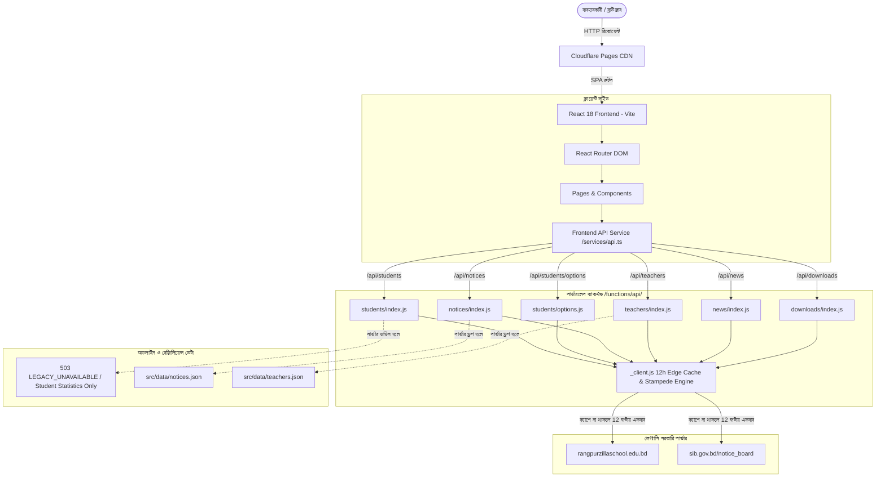

# রংপুর জিলা স্কুল | Rangpur Zilla School (EIIN: 127372)
> **Modern Web Portal & Legacy ASP.NET Web Forms Integration Engine**  
> *Established 1832 • Government Boys' High School, Rangpur, Bangladesh*  
> 🔗 **GitHub Repository:** [https://github.com/tarangohasan/rangpurzillaschool](https://github.com/tarangohasan/rangpurzillaschool)

---

> [!NOTE]
> **শিক্ষার্থী প্রদর্শনী প্রকল্প ঘোষণা (Educational Purpose Disclaimer)**  
> এই ওয়েবসাইটটি **রংপুর জিলা স্কুলের একজন শিক্ষার্থী কর্তৃক শুধুমাত্র শিক্ষামূলক, প্রযুক্তিগত গবেষণা ও পোর্টফোলিও প্রদর্শনের উদ্দেশ্যে (For Educational and Demonstration Purposes Only)** তৈরি করা হয়েছে। এটি বিদ্যালয়ের কোনো অফিশিয়াল বা প্রশাসনিক পরিবর্তন নয়; বরং বিদ্যমান তথ্য ও ডিজিটাল ব্যবস্থার আধুনিক, দ্রুততর ও মোবাইল-বান্ধব রূপ প্রদর্শনের একটি উন্মুক্ত অলাভজনক শিক্ষার্থী উদ্যোগ।  
> All institutional administration, official rights, and trademarks belong to Rangpur Zilla School and the Ministry of Education, Government of Bangladesh.

---

## 📌 সূচিপত্র (Table of Contents)
- [১. প্রকল্পের পরিচিতি (Project Overview)](#১-প্রকল্পের-পরিচিতি-project-overview)
- [২. প্রধান বৈশিষ্ট্যসমূহ (Key Features)](#২-প্রধান-বৈশিষ্ট্যসমূহ-key-features)
- [৩. কীভাবে কাজ করে (How It Works & Architecture)](#৩-কীভাবে-কাজ-করে-how-it-works--architecture)
  - [৩.১ আর্কিটেকচার ওভারভিউ (Architecture Overview)](#৩১-আর্কিটেকচার-ওভারভিউ-architecture-overview)
  - [৩.২ লেগ্যাসি ASP.NET ওয়েব ফর্মস পোস্টব্যাক ইঞ্জিন (Legacy Web Forms Postback Engine)](#৩২-লেগ্যাসি-aspnet-ওয়েব-ফর্মস-পোস্টব্যাক-ইঞ্জিন-legacy-web-forms-postback-engine)
  - [৩.৩ নোটিশ ফাইল হ্যান্ডলিং (Dual-Format Notice Handling)](#৩৩-নোটিশ-ফাইল-হ্যান্ডলিং-dual-format-notice-handling)
  - [৩.৪ টাইপোগ্রাফি ও ফন্ট ইঞ্জিন (Typography & Font Engine)](#৩৪-টাইপোগ্রাফি-ও-ফন্ট-ইঞ্জিন-typography--font-engine)
- [৪. প্রজেক্ট ডিরেক্টরি কাঠামো (Project Structure)](#৪-প্রজেক্ট-ডিরেক্টরি-কাঠামো-project-structure)
- [৫. এপিআই এন্ডপয়েন্টস (API Endpoints)](#৫-এপিআই-এন্ডপয়েন্টস-api-endpoints)
- [৬. লোকাল সেটআপ ও রান নির্দেশিকা (Local Setup & Run)](#৬-লোকাল-সেটআপ-ও-রান-নির্দেশিকা-local-setup--run)
- [৭. ক্লাউডফ্লেয়ার পেজেস ডিপ্লয়মেন্ট (Cloudflare Pages Deployment)](#৭-ক্লাউডফ্লেয়ার-পেজেস-ডিপ্লয়মেন্ট-cloudflare-pages-deployment)

---

## ১. প্রকল্পের পরিচিতি (Project Overview)

রংপুর জিলা স্কুল (EIIN: ১২৭৩৭২) ১৮৩২ খ্রিষ্টাব্দে প্রতিষ্ঠিত বাংলাদেশের অন্যতম প্রাচীন ও ঐতিহাসিক সরকারি মাধ্যমিক বিদ্যালয়। বিদ্যালয়ের বর্তমান প্রাতিষ্ঠানিক তথ্য ব্যবস্থাটি একটি ঐতিহ্যবাহী **ASP.NET Web Forms** ও IIS সার্ভারে পরিচালিত (`rangpurzillaschool.edu.bd` এবং `sib.gov.bd`)।

এই প্রকল্পের উদ্দেশ্য হলো:
1. **আধুনিক ও দ্রুতগতির ইউজার ইন্টারফেস**: React 18, Vite এবং Tailwind CSS এর মাধ্যমে সম্পূর্ণ রেস্পনসিভ, দৃষ্টিসুদর্শন ও প্রাতিষ্ঠানিক মানের একটি আধুনিক ওয়েব অ্যাপ্লিকেশন তৈরি করা।
2. **বাস্তব ও নির্ভুল তথ্য সংরক্ষণ (Zero Fabricated Data)**: বিদ্যালয়ের প্রকৃত ৫৫ জন শিক্ষক-কর্মকর্তা (PDS আইডি ও ছবি সহ), ৪৯৪টি নোটিশ, ভর্তি ফলাফল, পরীক্ষার পরিসংখ্যান এবং ১৮৩২ সালের ঐতিহাসিক বিবরণী সংরক্ষণ করা।
3. **লেগ্যাসি সিস্টেমের সাথে লাইভ ইন্টিগ্রেশন**: কোনো ব্রাউজার অটোমেশন বা ভারী স্ক্র্যাপার ছাড়াই সরাসরি Cloudflare Pages Functions-এর মাধ্যমে লেগ্যাসি ASP.NET সার্ভারের `__VIEWSTATE` ও সেশন হ্যান্ডলিং করে লাইভ শিক্ষার্থীদের তথ্য ও নোটিশ নিয়ে আসা।
4. **সম্পূর্ণ মোবাইল ফ্রেন্ডলি**: স্মার্টফোন থেকে শুরু করে বড় ডেস্কটপ স্ক্রিন—সব ডিভাইসেই কোনো টেক্সট ক্লিপিং বা ভাঙন ছাড়াই পরিষ্কার প্রদর্শনী।

---

## ২. প্রধান বৈশিষ্ট্যসমূহ (Key Features)

#### 🎓 ১. লাইভ শিক্ষার্থী অনুসন্ধান ইঞ্জিন (Live Students Directory & Privacy Policy)
- শ্রেণী (৩য়-১০ম), শিফট (প্রভাতি/দিবা) এবং সেকশন অনুযায়ী ফিল্টার করে শিক্ষার্থীদের তালিকা দেখা।
- রোল নম্বর, স্টুডেন্ট আইডি ও ছবি সহ কার্ড ভিউ ও টেবিল ভিউ সরাসরি লেগ্যাসি ASP.NET সার্ভার থেকে লাইভ লোড হয়।
- **Worker Credit Conservation & 12-Hour Caching**: পেজ লোড হওয়ার সময় কোনো অপ্রয়োজনীয় ব্যাকএন্ড কল করা হয় না। ব্যবহারকারী ড্রপডাউন সিলেক্ট করে সার্চ বাটনে ক্লিক করলেই শুধুমাত্র নির্দিষ্ট সেকশনের রিকোয়েস্ট পাঠানো হয়। সফল রিকোয়েস্ট ১২ ঘণ্টা (`43,200` সেকেন্ড) এজ ও লোকাল ক্যাশে সংরক্ষিত থাকে।
- **ব্যক্তিগত তথ্যের গোপনীয়তা ও কোনো লোকাল ফলব্যাক না থাকা (Zero Local Individual Fallback)**: শিক্ষার্থীর নাম, রোল বা ছবির মতো ব্যক্তিগত তথ্য রেপোজিটরিতে কোনো লোকাল ফলব্যাক ডেটাসেট হিসেবে সংরক্ষণ করা হয় না। লেগ্যাসি সার্ভার সাময়িকভাবে অনুপলব্ধ বা ডাউন থাকলে সিস্টেম একটি মার্জিত `503 LEGACY_UNAVAILABLE` স্টেট প্রদর্শন করে এবং সাধারণ শিক্ষার্থী পরিসংখ্যান (মোট ২,১০৯ জন) দেখার সুযোগ প্রদান করে।

### 📋 ২. নোটিশ বোর্ড ও স্মার্ট নোটিশ ভিউয়ার (Notice Board & Smart Viewer)
- ৪৯৪+ নোটিশের পূর্ণ আর্কাইভ, তারিখ ভিত্তিক ফিল্টারিং ও সার্চ।
- **ডুয়েল ফরম্যাট হ্যান্ডলার (.jpg / .pdf)**: `sib.gov.bd`-তে অনেক সার্কুলার স্ক্যান করা JPG ছবি হিসেবে থাকে, আবার কিছু ফাইল PDF থাকে। এই সিস্টেম স্বয়ংক্রিয়ভাবে সঠিক ফরম্যাট শনাক্ত করে এবং ব্যবহারকারীকে এক ক্লিকে JPG ⇄ PDF ভিউ পরিবর্তন করার সুযোগ দেয়, ফলে কোনো 404 ত্রুটি ঘটে না।
- এক ক্লিকে নোটিশ ফাইল ডাউনলোড ও প্রিভিউ।

### 👨‍🏫 ৩. শিক্ষক ও কর্মকর্তা পরিচিতি (Faculty Directory)
- বিদ্যালয়ের কর্মরত ৫৫ জন শিক্ষক-শিক্ষিকা ও কর্মকর্তা-কর্মচারীর পূর্ণাঙ্গ প্রোফাইল।
- সরকারি PDS আইডি, পদবী, বিষয়, ফোন নম্বর ও অফিশিয়াল ছবি প্রদর্শন।
- নাম, বিষয় ও পদবী অনুযায়ী দ্রুত লাইভ সার্চ ও ফিল্টার।

### 📊 ৪. একাডেমিক ফলাফল ও পরিসংখ্যান (Results & Analytics)
- এসএসসি (SSC) ও জেএসসি (JSC) পরীক্ষার ২০০৮ থেকে ২০২৪ পর্যন্ত বিগত ১৫+ বছরের ফলাফল ইতিহাস।
- মোট পরীক্ষার্থী, জিপিএ-৫, পাসের হার এবং বিজ্ঞান/ব্যবসায় শিক্ষা শাখার ফলাফল বিশ্লেষণ চার্ট ও মেট্রিক্স।
- সেকশন ও শিফট ভিত্তিক শিক্ষার্থী বণ্টন পরিসংখ্যান (মোট ২,১০৯ জন ছাত্র)।

### 📰 ৫. সংবাদ, নোটিশ টিকার ও ডাউনলোড সেন্টার
- **Notice Marquee**: হোমপেজে জরুরি নোটিশের মসৃণ অ্যানিমেটেড স্ক্রোলবার (মাউস হোভার বা টাচে পজ করার সুবিধা সহ)।
- **ডাউনলোড সেন্টার**: ১৯৫টি অফিশিয়াল ডকুমেন্ট—ভর্তি লটারি ফলাফল, পরীক্ষার সিলেবাস, রুটিন ও প্রাতিষ্ঠানিক ফরম।
- **ফটোগ্রাফি গ্যালারি**: ঐতিহাসিক ক্যাম্পাস ও পুনর্মিলনীর ৪৮টি সংগৃহীত আলোকচিত্র।

### 🎨 ৬. টাইপোগ্রাফি ও নান্দনিক ডিজাইন
- **Purno Font**: সকল বাংলা লেখার জন্য নির্ধারিত পূর্ণ ফন্ট (`Purno-Regular`, `Purno-Bold`, `Purno-Italic`, `Purno-BoldItalic`)।
- **Inter Font**: সকল ইংরেজি টেকস্ট, নম্বর ও মেটাডেটার জন্য আধুনিক Inter ফন্ট।
- প্রাতিষ্ঠানিক নেভি ব্লু (`#0f2b5c`) এবং মেটালিক গোল্ড অ্যাকসেন্ট দিয়ে তৈরি রুচিশীল অ্যাকাডেমিক রূপ।

---

## ৩. কীভাবে কাজ করে (How It Works & Architecture)

### ৩.১ আর্কিটেকচার ওভারভিউ (Architecture Overview)



---

### ৩.২ লেগ্যাসি ASP.NET ওয়েব ফর্মস পোস্টব্যাক ও ১২-ঘণ্টা ক্যাশিং ইঞ্জিন (Legacy Web Forms & 12-Hour Cache Engine)

লেগ্যাসি ASP.NET Web Forms-এ কোনো REST API থাকে না; বরং এটি সার্ভার-সাইড স্টেট মেশিন (`ViewState` ও `EventValidation`) ব্যবহার করে। 

Cloudflare Pages Function (`functions/api/students/index.js` ও `_client.js`) এই জটিল পোস্টব্যাককে একটি নির্বিঘ্ন ব্যাকএন্ড পাইপলাইনে রূপান্তর করেছে:

1. **সেশন হ্যান্ডশেক (Step 1: Session Acquisition)**:
   - প্রথমে লেগ্যাসি হোমপেজে একটি GET রিকোয়েস্ট পাঠানো হয়।
   - রেসপন্স হেডার থেকে `Set-Cookie: ASP.NET_SessionId=...` সংরক্ষণ করা হয়। (সেশন ছাড়া লেগ্যাসি সার্ভার সরাসরি ৩০২ রিডাইরেক্ট করে দেয়)।

2. **ড্রপডাউন ক্যাসকেডিং (Step 2: Postback Flow)**:
   - ব্যবহারকারী যখন ক্লাস নির্বাচন করেন, ফাংশনটি `__EVENTTARGET=ctl00$ContentPlaceHolder1$cmbClass` সহ POST রিকোয়েস্ট পাঠিয়ে শিফট তালিকা তৈরি করে।
   - একইভাবে শিফট সিলেক্ট হলে সেকশন তালিকা এবং সবশেষে সেকশন সিলেক্ট হলে `ctl00$ContentPlaceHolder1$grdvStudents` গ্রিডভিউ রেন্ডার হয়।

3. **HTML পার্সিং ও স্যানিটাইজেশন (Step 3: HTML Parsing)**:
   - লেগ্যাসি টেবিল থেকে রেগুলার এক্সপ্রেশন ও স্ট্রিং টোকেনাইজেশনের মাধ্যমে রোল, নাম, ছবি ও স্টুডেন্ট আইডি এক্সট্র্যাক্ট করে পরিচ্ছন্ন JSON ফরম্যাটে ফ্রন্টএন্ডে পাঠানো হয়।

4. **১২-ঘণ্টা সেন্ট্রালাইজড এজ ক্যাশ ও স্ট্যাম্পিড প্রোটেকশন (Step 4: 12-Hour Edge Caching & Coalescing)**:
   - **ডিফল্ট ক্যাশ পলিসি**: সমস্ত লেগ্যাসি-অরিজিন এপিআইতে ১২-ঘণ্টা (`DEFAULT_CACHE_TTL = 43200` সেকেন্ড) এজ ক্যাশ নীতি প্রয়োগ করা হয়েছে (`Cache-Control: public, max-age=43200, s-maxage=43200`)।
   - **ক্যুয়েরি প্যারামিটার নরমালাইজেশন**: `/api/students?class=Six&shift=Morning&section=A` এবং `/api/students?section=A&class=Six&shift=Morning` উভয়ই স্বয়ংক্রিয়ভাবে একটি ইউনিক ক্যাশ কী হিসেবে ট্রিট হয়। তবে ভিন্ন সেকশন বা ক্লাসের ক্যুয়েরিগুলো সম্পূর্ণ পৃথক ক্যাশ এন্ট্রি পায়।
   - **Cache Stampede Protection (Single-Flight)**: কোনো রিসোর্স যখন প্রথমবার ফেচ হয় বা ক্যাশ এক্সপায়ার হয়, তখন একযোগে ১০০টি রিকোয়েস্ট আসলেও অরিজিন সার্ভারে মাত্র ১টি আপস্ট্রিম রিকোয়েস্ট যায় এবং ফলাফলটি একই সাথে সবার কাছে পৌঁছে এজ ক্যাশে ১২ ঘণ্টার জন্য সংরক্ষিত হয়।
   - **ব্যর্থতা হ্যান্ডলিং ও ডাটা প্রাইভেসি**: লেগ্যাসি সার্ভার ডাউন থাকলে কোনো নকল ফলব্যাক ডেটা প্রদর্শন না করে তাৎক্ষণিক `503 LEGACY_UNAVAILABLE` এবং `no-store` হেডার পাঠানো হয়।

---

### ৩.৩ নোটিশ ফাইল হ্যান্ডলিং (Dual-Format Notice Handling)

সরকারি শিক্ষা বোর্ডের ফাইল সার্ভারে (`http://sib.gov.bd/notice_board/127372{id}.*`) ফাইলগুলো দুটি পৃথক ফরম্যাটে থাকে:
- পুরোনো নোটিশ ও জরুরি সার্কুলারগুলো সরাসরি স্ক্যান করা `.jpg` ছবি।
- কিছু অফিশিয়াল রুটিন ও গেজেট `.pdf` ফাইল।

সাধারণত কোনো নোটিশ যদি `.jpg` হিসেবে আপলোড হয়ে থাকে এবং ব্যবহারকারী সরাসরি `.pdf` এক্সটেনশনে রিকোয়েস্ট করেন, তবে IIS সার্ভার **404 Not Found** প্রদান করে।

**আমাদের সমাধান**:
`NoticeDetailPage.tsx` কম্পোনেন্টে একটি স্মার্ট ডুয়েল ফরম্যাট ভিউয়ার যুক্ত করা হয়েছে:
- এটি উভয় ফরম্যাটের ইউআরএল প্রিভিউ প্রস্তুত রাখে।
- ব্যবহারকারী চাইলে এক ক্লিকে **"ফরম্যাট পরিবর্তন (JPG ⇄ PDF)"** বাটনে টগল করতে পারেন।
- কোনো কারণে লেগ্যাসি ফাইল অ্যাক্সেসযোগ্য না হলে মূল সরকারি সাইটে সরাসরি যাওয়ার অল্টারনেটিভ লিংক প্রদান করে।

---

### ৩.৪ টাইপোগ্রাফি ও ফন্ট ইঞ্জিন (Typography & Font Engine)

- **বাংলা ফন্ট**: `Purno` ফন্ট পরিবার (`https://assets.selfstudy.xyz/fonts/purno/`) থেকে সরাসরি লোড করা হয়।
- **ফন্ট প্রিলোডিং**: `index.html`-এ `<link rel="preload">` ব্যবহার করায় পেজ লোডের সময় কোনো ফন্ট জাম্প বা ফ্ল্যাশ (FOIT/FOUT) হয় না।
- **কার-চিহ্ন সুরক্ষাবিধি**: নোটিশ টিকার এবং টেবিলগুলোতে পর্যাপ্ত লাইন-হাইট (`leading-relaxed`) ও ভার্টিকাল ক্লিয়ারেন্স থাকায় দীর্ঘ ই-কার (`ী`), উ-কার (`ু`), হসন্ত (`্`) বা রেফ কখনও কেটে যায় না।

---

## ৪. প্রজেক্ট ডিরেক্টরি কাঠামো (Project Structure)

```
rangpurzillaschool/
├── functions/                     # Cloudflare Pages Functions (সার্ভারলেস এপিআই)
│   └── api/
│       ├── _client.js             # লেগ্যাসি ASP.NET Session ও ViewState হ্যান্ডলার
│       ├── downloads/index.js     # ডাউনলোড ফাইল এপিআই
│       ├── news/index.js          # খবর ও সার্কুলার এপিআই
│       ├── notices/               # নোটিশ বোর্ড ও সিঙ্গেল নোটিশ এপিআই
│       ├── students/              # লাইভ শিক্ষার্থী পোস্টব্যাক ইঞ্জিন ও অপশনস এপিআই
│       └── teachers/index.js      # শিক্ষক-কর্মকর্তা এপিআই
│
├── public/                        # স্ট্যাটিক অ্যাসেটস
│   ├── _headers                   # ক্যাশিং ও সিকিউরিটি হেডার
│   ├── _redirects                 # SPA রিডাইরেক্ট রুলস
│   └── favicon.ico                # অফিশিয়াল আইকন
│
├── src/
│   ├── components/layout/         # গ্লোবাল লেআউট কম্পোনেন্টস
│   │   ├── Header.tsx             # রেস্পনসিভ হেডবার ও মোবাইল ড্রয়ার
│   │   ├── TopBar.tsx             # EIIN, প্রতিষ্ঠা সাল ও শিক্ষার্থী প্রকল্প ব্যানার
│   │   ├── NoticeTicker.tsx       # ইনফিনিট নোটিশ মার্কি অ্যানিমেশন
│   │   ├── Footer.tsx             # প্রাতিষ্ঠানিক ফুটার ও ডিসক্লেইমার ব্যানার
│   │   └── Layout.tsx             # মেইন লেআউট র‍্যাপার
│   │
│   ├── data/                      # ভেরিফাইড প্রাতিষ্ঠানিক ডেটাসেট (Zero Fabricated Data)
│   │   ├── teachers.json          # ৫৫ জন শিক্ষক-কর্মকর্তার তালিকা
│   │   ├── notices.json           # ৪৯৪টি নোটিশের পূর্ণাঙ্গ তালিকা
│   │   ├── news.json              # ৭৩টি সংবাদের তালিকা
│   │   ├── downloads.json         # ১৯৫টি অফিসিয়াল ডাউনলোড
│   │   ├── student_stats.json     # শিক্ষার্থী শাখা ও পরিসংখ্যান (২,১০৯ জন)
│   │   ├── exam_results.json      # বিগত ১৫ বছরের পাবলিক পরীক্ষার ফলাফল
│   │   ├── gallery.json           # ক্যাম্পাসের ৪৮টি ছবি
│   │   └── schoolInfo.ts          # প্রাতিষ্ঠানিক প্রোফাইল, ইতিহাস ও যোগাযোগ
│   │
│   ├── pages/                     # অ্যাপ্লিকেশন পেজ কম্পোনেন্টস
│   │   ├── HomePage.tsx           # আধুনিক প্রাতিষ্ঠানিক হোমপেজ
│   │   ├── AboutPage.tsx          # এক নজরে পরিচিতি
│   │   ├── HistoryPage.tsx        # ১৮৩২ সালের ঐতিহাসিক প্রেক্ষাপট
│   │   ├── TeachersPage.tsx       # শিক্ষক ও কর্মকর্তাদের লাইভ ডিরেক্টরি
│   │   ├── StudentsPage.tsx       # লাইভ শিক্ষার্থী অনুসন্ধান ও কার্ড ভিউ
│   │   ├── StudentStatsPage.tsx   # শাখা ও শিফট ভিত্তিক পরিসংখ্যান
│   │   ├── NoticesPage.tsx        # নোটিশ বোর্ড
│   │   ├── NoticeDetailPage.tsx   # ডুয়েল ফরম্যাট নোটিশ ভিউয়ার
│   │   ├── ExamResultsPage.tsx    # পাবলিক পরীক্ষার ফলাফল বিবরণী
│   │   ├── DownloadsPage.tsx      # রুটিন ও ভর্তি ডাউনলোড সেন্টার
│   │   ├── NewsPage.tsx           # খবর ও প্রেস বিজ্ঞপ্তি
│   │   ├── GalleryPage.tsx        # ছবির গ্যালারি
│   │   └── ContactPage.tsx        # যোগাযোগের ঠিকানা ও মানচিত্র
│   │
│   ├── services/api.ts            # সেন্ট্রালাইজড ফ্রন্টএন্ড এপিআই ক্লায়েন্ট
│   ├── types/index.ts             # টাইপস্ক্রিপ্ট টাইপ ডেফিনেশন
│   ├── index.css                  # Tailwind ডিরেক্টিভ ও Purno ফন্ট ম্যাপিং
│   └── main.tsx                   # অ্যাপ্লিকেশন এন্ট্রি পয়েন্ট
│
├── index.html                     # ফন্ট প্রিলোড ও মেটা ট্যাগ
├── tailwind.config.js             # Tailwind থিম ও কালার কনফিগারেশন
├── vite.config.ts                 # Vite বিল্ড কনফিগারেশন
└── wrangler.toml                  # Cloudflare Pages ডিপ্লয়মেন্ট কনফিগারেশন
```

---

## ৫. এপিআই এন্ডপয়েন্টস (API Endpoints)

| রুট (Route) | মেথড | ক্যাশ মেয়াদ (Cache TTL) | বিবরণ (Description) |
|---|---|---|---|
| `/api/students` | `GET` | **১২ ঘণ্টা** (`43,200s`) | শ্রেণী, শিফট ও সেকশন অনুযায়ী শিক্ষার্থীর তথ্য (`?class=...&shift=...&section=...`) |
| `/api/students/options` | `GET` | **১২ ঘণ্টা** (`43,200s`) | লেগ্যাসি সার্ভারের ড্রপডাউন অপশন তালিকা |
| `/api/notices` | `GET` | **১২ ঘণ্টা** (`43,200s`) | সর্বশেষ নোটিশের তালিকা ও পেজিনেশন |
| `/api/notices/[id]` | `GET` | **১২ ঘণ্টা** (`43,200s`) | নির্দিষ্ট নোটিশের বিস্তারিত বিবরণী ও ফাইলের লিঙ্ক |
| `/api/teachers` | `GET` | **১২ ঘণ্টা** (`43,200s`) | সকল শিক্ষক-কর্মকর্তার তালিকা ও PDS আইডি |
| `/api/news` | `GET` | **১২ ঘণ্টা** (`43,200s`) | প্রাতিষ্ঠানিক খবর ও নোটিফিকেশন |
| `/api/downloads` | `GET` | **১২ ঘণ্টা** (`43,200s`) | ভর্তি লটারি, সিলেবাস ও পরীক্ষার রুটিন ডাউনলোডের তালিকা |

---

## ৬. লোকাল সেটআপ ও রান নির্দেশিকা (Local Setup & Run)

### পূর্বশর্ত (Prerequisites)
- [Node.js](https://nodejs.org/) (সংস্করণ ১৮ বা তার পরবর্তী)
- `npm` প্যাকেজ ম্যানেজার

### ধাপসমূহ (Steps)

১. **রেপোজিটরি ক্লোন বা ডিরেক্টরিতে প্রবেশ করুন**:
```bash
cd "e:\Self Study\rangpurzillaschool"
```

২. **প্রয়োজনীয় প্যাকেজসমূহ ইনস্টল করুন**:
```bash
npm install
```

৩. **লোকাল ডেভেলপমেন্ট সার্ভার চালু করুন**:
```bash
npm run dev
```
ব্রাউজারে চালু হবে: `http://localhost:5173`

৪. **প্রোডাকশন বিল্ড তৈরি করুন**:
```bash
npm run build
```
এটি টাইপস্ক্রিপ্ট কম্পাইল করবে এবং অপ্টিমাইজড অ্যাসেট `dist/` ফোল্ডারে বিল্ড করবে।

৫. **ক্লাউডফ্লেয়ার ফাংশন সহ লোকাল টেস্ট (Wrangler)**:
```bash
npx wrangler pages dev dist
```

---

## ৭. ক্লাউডফ্লেয়ার পেজেস ডিপ্লয়মেন্ট (Cloudflare Pages Deployment)

এই প্রকল্পটি **Cloudflare Pages**-এ সরাসরি হোস্ট করার জন্য প্রস্তুত করা হয়েছে:

1. আপনার GitHub/GitLab অ্যাকাউন্টে কোডটি পুশ করুন।
2. **Cloudflare Dashboard**-এ প্রবেশ করে **Workers & Pages** > **Create application** > **Pages** নির্বাচন করুন।
3. আপনার গিট রিপোজিটরিটি কানেক্ট করুন।
4. বিল্ড সেটিংস কনফিগার করুন:
   - **Framework Preset**: `Vite`
   - **Build Command**: `npm run build`
   - **Build Output Directory**: `dist`
   - **Compatibility Date**: `2024-01-01`
5. **Save and Deploy** বাটনে ক্লিক করুন। 

ক্লাউডফ্লেয়ার স্বয়ংক্রিয়ভাবে `functions/` ডিরেক্টরিটিকে এজ ফাংশন এবং `dist/` ডিরেক্টরিটিকে গ্লোবাল CDN-এ হোস্ট করবে।

---

## 📜 কৃতজ্ঞতা ও ডিসক্লেইমার (Credits & Disclaimer)

- **বিদ্যালয়**: রংপুর জিলা স্কুল (EIIN: 127372), রংপুর সদর, রংপুর।
- **উৎস তথ্য**: `rangpurzillaschool.edu.bd` এবং `sib.gov.bd` (মাধ্যমিক ও উচ্চ শিক্ষা অধিদপ্তর ও শিক্ষা মন্ত্রণালয়)।
- **নির্মাতা**: রংপুর জিলা স্কুলের একজন শিক্ষার্থী কর্তৃক শুধুমাত্র শিক্ষামূলক ও আধুনিক ওয়েব প্রযুক্তি প্রদর্শনীর উদ্দেশ্যে নির্মিত।
- **গিটহাব রিপোজিটরি**: [github.com/tarangohasan/rangpurzillaschool](https://github.com/tarangohasan/rangpurzillaschool)
